# loadtest / Locust / MLflow deep dive

## What this document is for

This document zooms in on the loadtest stage behind:

- `make loadtest`
- the `==> Loadtest` stage inside `scripts/e2e_gpu.sh`

The goal is to explain how this repo turns a simple Locust run into a reproducible benchmark artifact with both HTML/JSON output and MLflow logging.

## The shortest mental model

The loadtest path is not just:

> run Locust against `/v1/chat/completions`

It is actually:

> load a `LoadTestConfig` -> derive a canonical run id and artifact paths -> assemble a Locust command with OpenAI-specific arguments -> let `scripts/loadtest_locust.py` define the actual user behavior -> write JSON and HTML reports -> log those reports and the run parameters to MLflow

## Visual overview



## Ordered loadtest codepath

1. either `make loadtest` or `scripts/e2e_gpu.sh` decides to start a load test
2. Python loads YAML into `LoadTestConfig`
3. `resolve_loadtest_artifacts` computes the canonical run directory and report filenames
4. orchestration code resolves the effective model name from `serve.served_model_name` or `serve.model_id`
5. orchestration builds a `python -m locust -f scripts/loadtest_locust.py ...` command
6. Locust starts and the script registers custom arguments (`--model`, `--prompt`, `--max-tokens`, `--json-report`)
7. `OpenAIChatUser` repeatedly POSTs to `/v1/chat/completions`
8. response validation marks requests failed when status, JSON shape, or `choices` are wrong
9. on shutdown, a quitting hook writes `locust_report.json`
10. Locust itself writes the HTML report
11. repo code calls `log_loadtest_reports()`
12. MLflow logs params plus the HTML/JSON report artifacts

## Why the loadtest path is split across three places

The design is intentionally split:

- **orchestration layer** (`Makefile` / `e2e_gpu.sh`) decides when and how to run Locust
- **workload definition layer** (`scripts/loadtest_locust.py`) defines what one virtual user actually does
- **artifact/logging layer** (`src/aiinfra_e2e/loadtest.py`) defines run ids, report paths, payload defaults, and MLflow integration

That separation keeps the Locust script focused on traffic generation rather than experiment bookkeeping.

## Core files and what each one does

### 1. `configs/serve/loadtest.yaml`

This is the checked-in source of truth for loadtest defaults:
- run name
- output dir
- users
- spawn rate
- run time
- prompt
- max tokens
- serve target
- MLflow target

### 2. `scripts/loadtest_locust.py`

This is the actual Locust workload definition.

It owns:
- custom CLI arguments
- the HTTP POST workload to `/v1/chat/completions`
- response validation rules
- writing the JSON summary on shutdown

### 3. `src/aiinfra_e2e/loadtest.py`

This file owns repo-specific loadtest policy:
- canonical run id
- canonical report paths
- payload construction rules
- MLflow logging of params and artifacts

### 4. `scripts/e2e_gpu.sh`

This is where `make e2e` wires serving and load testing together. It resolves the effective serve port first, then points loadtest at that port.

## The key codepath hops

### Hop 1: checked-in config defines the benchmark defaults
**File:** `configs/serve/loadtest.yaml:1-14`
```yaml
run_name: serve-loadtest
output_dir: artifacts/runs
users: 4
spawn_rate: 2
run_time: 1m
prompt: Say hello in one short sentence.
max_tokens: 64
serve:
  host: 127.0.0.1
  port: 8000
  served_model_name: qwen2.5-7b-instruct
obs:
  tracking_uri: mlruns
  experiment_name: loadtest
```

This file describes the benchmark in a repo-owned way, before any runtime rewriting happens.

### Hop 2: `make loadtest` assembles a one-shot Python launcher
**File:** `Makefile:49-59`
```make
loadtest: ensure-venv
	@if ! $(PYTHON) -c "import importlib.util,sys; sys.exit(0 if importlib.util.find_spec('locust') else 1)"; then \
		printf 'Skipping loadtest: locust is not installed ...\n'; \
		exit 0; \
	fi
	@if [ -z "$(LOADTEST_HOST)" ]; then \
		printf 'Skipping loadtest: set LOADTEST_HOST ...\n'; \
		exit 0; \
	fi
```

This target is deliberately defensive: it refuses to pretend loadtest ran when `locust` or the host URL are missing.

### Hop 3: `make e2e` does the same orchestration inline after serving is ready
**File:** `scripts/e2e_gpu.sh:257-301`
```python
config = load_yaml(os.environ["EFFECTIVE_LOADTEST_CONFIG"], LoadTestConfig)
artifacts = resolve_loadtest_artifacts(config)
artifacts.run_dir.mkdir(parents=True, exist_ok=True)
model_name = config.serve.served_model_name or config.serve.model_id
...
command = [
    sys.executable,
    "-m",
    "locust",
    "-f",
    os.path.join(os.environ["REPO_ROOT"], "scripts", "loadtest_locust.py"),
    "--headless",
    "--host",
    config.serve.base_url,
    ...
]
subprocess.run(command, check=True)
log_loadtest_reports(config=config, artifacts=artifacts)
```

This is the crucial integration point between the serve stage and the benchmark stage.

### Hop 4: canonical artifact naming lives in `loadtest.py`
**File:** `src/aiinfra_e2e/loadtest.py:24-38`
```python
def resolve_loadtest_run_id(config: LoadTestConfig) -> str:
    if config.run_name:
        return config.run_name
    return f"loadtest-{config.users}u"


def resolve_loadtest_artifacts(config: LoadTestConfig) -> LoadTestArtifacts:
    run_id = resolve_loadtest_run_id(config)
    run_dir = Path(config.output_dir) / run_id
    return LoadTestArtifacts(
        run_id=run_id,
        run_dir=run_dir,
        html_report_path=run_dir / "locust_report.html",
        json_report_path=run_dir / "locust_report.json",
    )
```

This is why HTML and JSON reports always land in a predictable place under `artifacts/runs/<run_id>/`.

### Hop 5: payload policy is kept small and explicit
**File:** `src/aiinfra_e2e/loadtest.py:41-49`
```python
def build_chat_completions_payload(config: LoadTestConfig) -> dict[str, object]:
    model = config.serve.served_model_name or config.serve.model_id
    if model is None:
        raise ValueError(...)
    return {
        "model": model,
        "messages": [{"role": "user", "content": config.prompt}],
        "max_tokens": config.max_tokens,
    }
```

This keeps the repo's OpenAI request contract centralized.

### Hop 6: Locust script defines user behavior and extra CLI args
**File:** `scripts/loadtest_locust.py:60-80`
```python
@events.init_command_line_parser.add_listener
def _add_custom_arguments(parser) -> None:
    parser.add_argument("--model", type=str, required=True, ...)
    parser.add_argument("--prompt", type=str, default="Say hello in one short sentence.", ...)
    parser.add_argument("--max-tokens", type=int, default=64, ...)
    parser.add_argument("--json-report", type=str, default=os.environ.get("LOADTEST_JSON_REPORT"), ...)
```

This is how repo-specific OpenAI benchmark parameters enter an otherwise standard Locust process.

### Hop 7: one virtual user sends a chat-completions request
**File:** `scripts/loadtest_locust.py:83-104`
```python
class OpenAIChatUser(HttpUser):
    wait_time = between(0.5, 1.5)
    host = os.environ.get("LOADTEST_HOST", "http://127.0.0.1:8000")

    @task
    def chat_completion(self) -> None:
        response = self.client.post(
            "/v1/chat/completions",
            json=_build_payload(self.environment),
            name="POST /v1/chat/completions",
        )
        if response.status_code >= 400:
            response.failure(...)
            return
        ...
        if not payload.get("choices"):
            response.failure("Response did not include choices")
```

This is the actual workload. Everything else is setup or bookkeeping.

### Hop 8: JSON summary is written by a Locust quitting hook
**File:** `scripts/loadtest_locust.py:106-128`
```python
@events.quitting.add_listener
def _write_json_report(environment: Environment, **_: object) -> None:
    ...
    payload = {
        "target_host": environment.host,
        "endpoint": "/v1/chat/completions",
        "requests": total.num_requests,
        "failures": total.num_failures,
        "median_response_time": total.median_response_time,
        "average_response_time": total.avg_response_time,
        ...
    }
    report_path.write_text(json.dumps(payload, indent=2, sort_keys=True) + "\n", encoding="utf-8")
```

The HTML report is Locust-native; the JSON report is a repo-defined summary file.

### Hop 9: MLflow logging happens after the Locust process exits
**File:** `src/aiinfra_e2e/loadtest.py:52-72`
```python
def log_loadtest_reports(*, config: LoadTestConfig, artifacts: LoadTestArtifacts) -> None:
    with start_mlflow_run(
        tracking_uri=config.obs.tracking_uri,
        experiment_name=config.obs.experiment_name,
        run_name=artifacts.run_id,
    ):
        _ = mlflow.log_params(
            {
                "endpoint": CHAT_COMPLETIONS_ENDPOINT,
                "html_report": str(artifacts.html_report_path),
                "json_report": str(artifacts.json_report_path),
                "target_host": config.serve.base_url,
                "users": str(config.users),
                "spawn_rate": str(config.spawn_rate),
                "run_time": config.run_time,
            }
        )
        if artifacts.html_report_path.exists():
            mlflow.log_artifact(str(artifacts.html_report_path))
        if artifacts.json_report_path.exists():
            mlflow.log_artifact(str(artifacts.json_report_path))
```

This means MLflow logging is based on persisted reports, not in-memory Locust stats.

## What the tests tell you about the loadtest contract

`tests/test_loadtest_config.py` is effectively the loadtest spec.

It verifies:
- `loadtest.yaml` parses into `LoadTestConfig`
- wildcard serve hosts normalize to a usable base URL
- payload construction chooses `served_model_name` when available
- report paths always live under `artifacts/runs/<run_id>/`
- `log_loadtest_reports()` logs the expected params and artifact paths to MLflow

## The most important architectural insight

The repo treats benchmarking as an **artifact-producing stage**, not just a transient traffic run.

That is why loadtest is not implemented as a bare Locust script alone. The repo wants:
- stable run ids
- stable report paths
- reproducible OpenAI request parameters
- a JSON summary for automation/review
- MLflow visibility for benchmark outputs

So the actual design is:

> Locust generates traffic, but the repo owns experiment semantics.

## Suggested reading order for the loadtest path

1. `configs/serve/loadtest.yaml`
2. `src/aiinfra_e2e/loadtest.py`
3. `scripts/loadtest_locust.py`
4. `scripts/e2e_gpu.sh` loadtest block
5. `tests/test_loadtest_config.py`

## Short takeaway

If you want one sentence that captures the loadtest design, it is this:

> this repo wraps Locust in a thin experiment-management layer so that serving benchmarks become stable files and MLflow artifacts instead of just console output.
