# make e2e codepath review

## What is being traced

- command: `make e2e`
- shell entrypoint: `scripts/e2e_gpu.sh`
- Python CLI entrypoint: `python -m aiinfra_e2e.cli`

## Ordered codepath

1. `make e2e` checks that `.venv/bin/python` exists and then launches `scripts/e2e_gpu.sh`
2. `e2e_gpu.sh` exports config paths, cache paths, and an optional generated obs config
3. the script selects `CUDA_VISIBLE_DEVICES` via `aiinfra_e2e.gpu.select_cuda_visible_devices`
4. the script builds temporary effective serve/loadtest YAML files with free ports
5. the script validates configs through CLI stubs and direct `load_yaml` calls
6. the script runs dataset sync with `load_hf_dataset`
7. the script preprocesses one sample with `preprocess_record`
8. the script launches training through `aiinfra_e2e.cli train sft`
9. `train sft` dispatches to `run_sft_from_paths -> run_sft`
10. the script runs offline eval through `run_offline_eval`
11. the script launches serving through `aiinfra_e2e.cli serve`
12. `serve` dispatches to `run_vllm_server_from_config -> ManagedVLLMServer.start`
13. the script polls `/v1/models` with `openai_request`
14. the script runs Locust and then logs reports through `log_loadtest_reports`
15. the script prints success and cleanup runs on shell exit

## Visual mapping



## Snippets

### 1. Makefile dispatches into the shell script
**File:** `Makefile:31-38`
```make
test: ensure-venv
	$(PYTHON) -m pytest -q

smoke: ensure-venv
	PYTHON_BIN="$(PYTHON)" bash scripts/smoke_cpu.sh

e2e: ensure-venv
	PYTHON_BIN="$(PYTHON)" bash scripts/e2e_gpu.sh
```

This is the first critical boundary. `make e2e` does not invoke a Python function directly; it enters a shell script with `PYTHON_BIN` pinned to `.venv/bin/python`.

### 2. The shell script defines all stage configs and cache paths
**File:** `scripts/e2e_gpu.sh:8-26`
```bash
DATA_CONFIG=${DATA_CONFIG:-$REPO_ROOT/configs/data/alpaca_zh_51k.yaml}
TRAIN_CONFIG=${TRAIN_CONFIG:-$REPO_ROOT/configs/train/qwen2p5_7b_qlora_ddp4.yaml}
EVAL_CONFIG=${EVAL_CONFIG:-$REPO_ROOT/configs/eval/offline.yaml}
SERVE_CONFIG=${SERVE_CONFIG:-$REPO_ROOT/configs/serve/vllm_openai_lora.yaml}
LOADTEST_CONFIG=${LOADTEST_CONFIG:-$REPO_ROOT/configs/serve/loadtest.yaml}
...
: "${HF_HOME:=$HF_DEFAULT_ROOT}"
: "${HF_HUB_CACHE:=$HF_DEFAULT_CACHE_ROOT/hub}"
: "${HF_DATASETS_CACHE:=$HF_DEFAULT_CACHE_ROOT/datasets}"
: "${TRANSFORMERS_CACHE:=$HF_DEFAULT_CACHE_ROOT/transformers}"
mkdir -p "$HF_HOME" "$HF_HUB_CACHE" "$HF_DATASETS_CACHE" "$TRANSFORMERS_CACHE"
```

This is where runtime environment policy is established.

### 3. The shell script always routes CLI calls through the project Python
**File:** `scripts/e2e_gpu.sh:28-30`
```bash
run_cli() {
  "$PYTHON_BIN" -m aiinfra_e2e.cli "$@"
}
```

This was an important reliability fix: it avoids accidentally running a global `aiinfra-e2e` executable from another Python environment.

### 4. Shared-host runtime adaptation happens before any heavy work
**File:** `scripts/e2e_gpu.sh:57-76`
```bash
printf '==> GPU selection\n'
CUDA_SELECTION=$(
  CUDA_VISIBLE_DEVICES="${CUDA_VISIBLE_DEVICES-}" "$PYTHON_BIN" - <<'PY'
import os
from aiinfra_e2e.gpu import select_cuda_visible_devices
selected = select_cuda_visible_devices(os.environ.get("CUDA_VISIBLE_DEVICES"))
if selected is not None:
    print(selected)
PY
)
```

**File:** `scripts/e2e_gpu.sh:109-147`
```python
serve_config = load_yaml(os.environ["ORIGINAL_SERVE_CONFIG"], ServeConfig)
loadtest_config = load_yaml(os.environ["ORIGINAL_LOADTEST_CONFIG"], LoadTestConfig)
...
serve_payload["port"] = selected_serve_port
serve_payload["metrics_port"] = selected_metrics_port
loadtest_payload["serve"]["port"] = selected_serve_port
```

This is one of the most important design ideas in the repo: the checked-in configs stay stable, but `e2e_gpu.sh` writes **effective runtime configs** for the current host.

### 5. CLI commands mostly validate configs, except `train sft` and `serve`
**File:** `src/aiinfra_e2e/cli.py:122-199`
```python
@app.command("data")
def data_command(config: ConfigOption = None) -> None:
    _handle_stub_command("Data", config, DataConfig)
...
@train_app.command("sft")
def train_sft_command(...):
    from aiinfra_e2e.train.sft import run_sft_from_paths
    ...
    run_dir = run_sft_from_paths(...)
...
@app.command("serve")
def serve_command(config: ConfigOption = None) -> None:
    serve_config = cast(ServeConfig, _load_config(config, ServeConfig))
    run_vllm_server_from_config(serve_config)
```

A subtle but important point: `data`, `eval`, and `loadtest` CLI commands are mostly config validators. The real e2e work for those stages happens in inline Python snippets inside `e2e_gpu.sh`.

### 6. Data sync uses Hugging Face datasets with retry and configured cache_dir
**File:** `src/aiinfra_e2e/data/hf_sync.py:33-56`
```python
def load_hf_dataset(config: DataConfig, ..., dataset_loader: Callable[..., Any] | None = None):
    ...
    return loader(config.dataset_id, split=config.split, cache_dir=config.cache_dir)
```

This is why the dataset stage depends on `DataConfig.cache_dir` and not just global HF environment variables.

### 7. Preprocess converts one Alpaca-style record into SFT tokens + labels
**File:** `src/aiinfra_e2e/data/preprocess.py:42-75`
```python
def preprocess_record(record: dict[str, Any], *, tokenizer: Any, ... ) -> SFTRecord:
    instruction = str(record[instruction_field])
    ...
    messages = build_messages(...)
    text = render_prompt(messages, tokenizer=tokenizer)
    input_ids = _tokenize_text(tokenizer, text)
    prefix_ids = _build_user_prefix(messages, tokenizer=tokenizer)
    labels = [-100] * len(input_ids)
    labels[assistant_start:] = input_ids[assistant_start:]
```

This is the core label-masking step for supervised fine-tuning.

### 8. Training dispatches from CLI into `run_sft`
**File:** `src/aiinfra_e2e/train/sft.py:531-549`
```python
def run_sft_from_paths(*, data_config_path, train_config_path, obs_config_path) -> Path:
    return run_sft(
        data_config=load_yaml(resolved_data_path, DataConfig),
        train_config=load_yaml(resolved_train_path, TrainConfig),
        obs_config=load_yaml(resolved_obs_path, ObsConfig),
        ...
    )
```

`run_sft_from_paths` is the bridge from YAML-based orchestration into the real trainer implementation.

### 9. `run_sft` writes artifacts and logs MLflow outputs
**File:** `src/aiinfra_e2e/train/sft.py:507-528`
```python
_log_mlflow_run(
    obs_config=obs_config,
    run_id=run_id,
    manifest_path=manifest_path,
    train_config_path=train_config_path,
    params={...},
    final_loss=final_loss,
)
logger.info("Finished SFT run %s with loss %.6f", run_id, final_loss)
return run_dir
```

This is where the train stage becomes a tracked experiment instead of just a local training loop.

### 10. Offline eval is a standalone Python function, not a CLI workflow
**File:** `src/aiinfra_e2e/eval/offline.py:65-127`
```python
def run_offline_eval(*, eval_config: EvalConfig, obs_tracking_uri: str, obs_experiment_name: str, generator: Generator) -> OfflineEvalResult:
    run_id = _resolve_run_id(eval_config)
    run_dir = Path(eval_config.output_dir) / run_id
    ...
    report_path = run_dir / "eval_report.json"
    ...
    _log_mlflow_report(...)
    return OfflineEvalResult(...)
```

The current `make e2e` flow passes a simple lambda generator, so offline eval is more of a report/metrics stage than a live model-scoring stage.

### 11. Serving goes through a subprocess wrapper around vLLM
**File:** `src/aiinfra_e2e/serve/vllm_server.py:137-149`
```python
def start(self) -> None:
    ...
    self.process = subprocess.Popen(
        build_vllm_command(self.config),
        env=build_vllm_environment(self.config),
        text=True,
    )
    self.wait_until_ready(timeout=self.config.startup_timeout_seconds)
```

**File:** `src/aiinfra_e2e/serve/vllm_server.py:179-190`
```python
def run_vllm_server_from_config(config: ServeConfig) -> None:
    server = ManagedVLLMServer(config)
    try:
        server.start()
        while True:
            time.sleep(1.0)
            server.metrics.update_gpu_memory()
```

Serving is intentionally wrapped so the repo can manage startup env, readiness polling, and metrics outside the raw vLLM command.

### 12. Readiness polling uses the normalized base URL and bypasses localhost proxies
**File:** `src/aiinfra_e2e/serve/vllm_server.py:86-107`
```python
def openai_request(base_url: str, path: str, *, payload=None, method="GET", timeout: float = 5.0) -> dict[str, Any]:
    http_request = _json_request(f"{base_url.rstrip('/')}{path}", payload=payload, method=method)
    if _is_localhost_url(base_url):
        opener = request.build_opener(request.ProxyHandler({}))
        response_context = opener.open(http_request, timeout=timeout)
```

This is a practical shared-host fix. It prevents localhost readiness checks from being sent through a corporate proxy.

### 13. Load testing is split between shell, Locust, and MLflow logging helpers
**File:** `scripts/e2e_gpu.sh:257-301`
```python
config = load_yaml(os.environ["EFFECTIVE_LOADTEST_CONFIG"], LoadTestConfig)
artifacts = resolve_loadtest_artifacts(config)
...
subprocess.run(command, check=True)
log_loadtest_reports(config=config, artifacts=artifacts)
print(f"Loadtest reports: {artifacts.html_report_path}, {artifacts.json_report_path}")
```

**File:** `src/aiinfra_e2e/loadtest.py:30-38`
```python
def resolve_loadtest_artifacts(config: LoadTestConfig) -> LoadTestArtifacts:
    run_id = resolve_loadtest_run_id(config)
    run_dir = Path(config.output_dir) / run_id
    return LoadTestArtifacts(...)
```

**File:** `src/aiinfra_e2e/loadtest.py:52-72`
```python
def log_loadtest_reports(*, config: LoadTestConfig, artifacts: LoadTestArtifacts) -> None:
    with start_mlflow_run(...):
        mlflow.log_params({...})
        if artifacts.html_report_path.exists():
            mlflow.log_artifact(str(artifacts.html_report_path))
```

The shell script owns process orchestration, while `loadtest.py` owns artifact naming and MLflow logging.

## Short summary

- The real driver is `scripts/e2e_gpu.sh`, not the CLI.
- The CLI is partly a runtime dispatcher and partly a config validation surface.
- `train sft` and `serve` are the two most direct CLI-to-implementation paths.
- `data sync`, `preprocess sample`, `offline eval`, and `loadtest` are orchestrated by inline Python blocks in the shell script.
- The repo is designed around **pragmatic host adaptation**: GPU auto-selection, free-port selection, HF cache control, serve readiness polling, and MLflow artifact logging.
