# make e2e overview

## What this document is for

This repo has a lot of moving parts, but `make e2e` is the main orchestrated demo path. This document gives you the shortest useful mental model before you dive into the code.

## Top-level summary

`make e2e` is a **shell-orchestrated end-to-end pipeline** that does all of the following in sequence:

1. pins execution to the project virtualenv
2. selects a usable GPU on a shared machine
3. rewrites effective serve/loadtest configs at runtime
4. validates configs
5. downloads/loads the Hugging Face dataset
6. preprocesses one sample for sanity-checking
7. runs TRL/PEFT QLoRA SFT training
8. runs offline evaluation
9. launches a vLLM OpenAI-compatible server
10. waits for `/v1/models` readiness
11. runs a Locust load test
12. logs artifacts to MLflow and writes reports under `artifacts/`

## Visual overview



## The outer entrypoint

**File:** `Makefile:34-38`
```make
smoke: ensure-venv
	PYTHON_BIN="$(PYTHON)" bash scripts/smoke_cpu.sh

e2e: ensure-venv
	PYTHON_BIN="$(PYTHON)" bash scripts/e2e_gpu.sh
```

The important point is that `make e2e` does **not** call Python directly. It enters through `scripts/e2e_gpu.sh`, and the Makefile forces that script to use `.venv/bin/python`.

## Where the real orchestration lives

**File:** `scripts/e2e_gpu.sh:8-17`
```bash
DATA_CONFIG=${DATA_CONFIG:-$REPO_ROOT/configs/data/alpaca_zh_51k.yaml}
TRAIN_CONFIG=${TRAIN_CONFIG:-$REPO_ROOT/configs/train/qwen2p5_7b_qlora_ddp4.yaml}
EVAL_CONFIG=${EVAL_CONFIG:-$REPO_ROOT/configs/eval/offline.yaml}
SERVE_CONFIG=${SERVE_CONFIG:-$REPO_ROOT/configs/serve/vllm_openai_lora.yaml}
LOADTEST_CONFIG=${LOADTEST_CONFIG:-$REPO_ROOT/configs/serve/loadtest.yaml}
OBS_CONFIG=${OBS_CONFIG:-}
OBS_TRACKING_URI=${OBS_TRACKING_URI:-mlruns}
OBS_EXPERIMENT_NAME=${OBS_EXPERIMENT_NAME:-gpu-e2e-demo}
```

The script decides:
- which config files are used
- where temporary effective configs go
- where Hugging Face caches go
- how serving and load testing are coordinated

## How Python enters the flow

The script uses this helper:

**File:** `scripts/e2e_gpu.sh:28-30`
```bash
run_cli() {
  "$PYTHON_BIN" -m aiinfra_e2e.cli "$@"
}
```

That means all CLI stages flow through `src/aiinfra_e2e/cli.py`, but some stages in `e2e_gpu.sh` are also inline Python snippets that call implementation modules directly.

## Recommended reading order

1. `docs/reviews/make-e2e-codepath-review.md`
2. `docs/reviews/repo-structure-map.md`
3. `scripts/e2e_gpu.sh`
4. `src/aiinfra_e2e/cli.py`
5. `src/aiinfra_e2e/train/sft.py`
6. `src/aiinfra_e2e/serve/vllm_server.py`

## Short takeaway

If you only remember one thing, remember this:

> `make e2e` is mostly a carefully-written shell pipeline that coordinates several Python subsystems, not a single Python function call.
