# serve / vLLM deep dive

## What this document is for

This document zooms in on the `serve` stage only.

The goal is to answer four questions:

1. what actually happens when the repo starts serving
2. why the repo wraps vLLM in its own subprocess manager
3. where host-specific reliability logic lives
4. which tests encode the serving contract

## The shortest mental model

The serve path is not just:

> run vLLM

It is actually:

> load a `ServeConfig` -> build a safe child-process environment -> start a wrapped vLLM subprocess -> patch child startup behavior through `sitecustomize.py` -> poll readiness through `/v1/models` -> publish wrapper-side metrics -> keep the wrapper alive until shutdown

## Visual overview



## Ordered serve codepath

1. `scripts/e2e_gpu.sh` eventually runs `python -m aiinfra_e2e.cli serve --config <effective-serve-config>`
2. `aiinfra_e2e.cli.serve_command` loads YAML into `ServeConfig`
3. `serve_command` calls `run_vllm_server_from_config(serve_config)`
4. `run_vllm_server_from_config` constructs a `ManagedVLLMServer`
5. `ManagedVLLMServer.start()` starts the wrapper metrics server
6. `ManagedVLLMServer.start()` builds the raw vLLM command
7. `ManagedVLLMServer.start()` builds the child env with compat flags
8. `ManagedVLLMServer.start()` launches `vllm.entrypoints.openai.api_server` via `subprocess.Popen`
9. the child process imports `sitecustomize.py`, which conditionally applies startup patches
10. the wrapper polls `/v1/models` until ready or timed out
11. after startup, the wrapper loops forever and periodically updates GPU metrics
12. on interruption or script cleanup, the wrapper terminates the subprocess cleanly

## Why this repo does not run vLLM directly

The wrapper exists because this host environment is messy in real life.

It needs to solve problems that raw `python -m vllm.entrypoints.openai.api_server ...` does not solve for the repo on its own:

- inject repo-local Python startup hooks into the child process
- normalize localhost readiness checks
- avoid proxy interference when polling localhost
- expose wrapper-side Prometheus metrics
- own startup timeout behavior
- keep the serve lifecycle under the repo's control rather than letting the shell script guess

## Core files and what each one does

### 1. `src/aiinfra_e2e/serve/vllm_server.py`

This is the control-center file.

It owns:
- command construction
- child environment construction
- readiness polling
- subprocess lifecycle
- proxy bypass for localhost readiness calls

### 2. `sitecustomize.py`

This is the child-startup injection point.

The wrapper adds the repo root to `PYTHONPATH`, so when the vLLM subprocess starts Python, it imports this file automatically. That gives the repo one narrow hook to patch startup behavior in the child process.

### 3. `src/aiinfra_e2e/serve/tokenizer_compat.py`

This shim patches tokenizer API shape when vLLM expects `all_special_tokens_extended` but the tokenizer base does not provide it.

### 4. `src/aiinfra_e2e/serve/tqdm_compat.py`

This shim patches a known vLLM/tqdm constructor mismatch around duplicate `disable` kwargs.

### 5. `src/aiinfra_e2e/serve/metrics.py`

This file exposes wrapper-side Prometheus metrics for adapter loads, request failures, and GPU memory.

### 6. `src/aiinfra_e2e/serve/adapters.py`

This file is not part of the basic startup path, but it defines the repo's LoRA adapter lifecycle request shapes and request helpers.

## The key codepath hops

### Hop 1: CLI dispatch into serving
**File:** `src/aiinfra_e2e/cli.py:175-185`
```python
@app.command("serve")
def serve_command(config: ConfigOption = None) -> None:
    if config is None:
        typer.echo("Serve command stub. Provide --config to start a YAML-configured server.")
        return

    serve_config = cast(ServeConfig, _load_config(config, ServeConfig))
    typer.echo(f"Started serve wrapper from {config}")
    run_vllm_server_from_config(serve_config)
```

This is the only CLI hop that really matters for serving. Once it has a valid `ServeConfig`, control moves into the wrapper.

### Hop 2: raw vLLM command construction
**File:** `src/aiinfra_e2e/serve/vllm_server.py:38-68`
```python
def build_vllm_command(config: ServeConfig) -> list[str]:
    if not config.model_id:
        raise ValueError("Serve config must set model_id to start vLLM.")

    command = [
        sys.executable,
        "-m",
        "vllm.entrypoints.openai.api_server",
        "--host", config.host,
        "--port", str(config.port),
        "--model", config.model_id,
        "--enable-lora",
        "--tensor-parallel-size", str(config.tensor_parallel_size),
        "--max-loras", str(config.max_loras),
        "--max-lora-rank", str(config.max_lora_rank),
    ]
```

This file proves that the repo is still using the standard vLLM OpenAI server, but with repo-owned flags around LoRA and runtime settings.

### Hop 3: child-process environment shaping
**File:** `src/aiinfra_e2e/serve/vllm_server.py:24-35`
```python
def build_vllm_environment(config: ServeConfig) -> dict[str, str]:
    env = dict(os.environ)
    repo_root = Path(__file__).resolve().parents[3]
    existing_pythonpath = env.get("PYTHONPATH")
    env["PYTHONPATH"] = (
        f"{repo_root}{os.pathsep}{existing_pythonpath}" if existing_pythonpath else str(repo_root)
    )
    env["AIINFRA_E2E_ENABLE_VLLM_TOKENIZER_COMPAT"] = "1"
    env["AIINFRA_E2E_ENABLE_VLLM_TQDM_COMPAT"] = "1"
    env["VLLM_ALLOW_RUNTIME_LORA_UPDATING"] = "True"
    return env
```

This is arguably the most important design choice in the serving path. The repo does not monkeypatch the current Python process and hope for the best; it shapes the child-process environment explicitly.

### Hop 4: child startup hook through `sitecustomize.py`
**File:** `sitecustomize.py:1-12`
```python
import os
from aiinfra_e2e.serve.tokenizer_compat import ensure_all_special_tokens_extended
from aiinfra_e2e.serve.tqdm_compat import ensure_vllm_tqdm_compat

if os.environ.get("AIINFRA_E2E_ENABLE_VLLM_TOKENIZER_COMPAT") == "1":
    ensure_all_special_tokens_extended()

if os.environ.get("AIINFRA_E2E_ENABLE_VLLM_TQDM_COMPAT") == "1":
    ensure_vllm_tqdm_compat()
```

This is how the child process gets repo-local startup patches without modifying vLLM's installed package files.

### Hop 5: subprocess lifecycle and readiness timeout
**File:** `src/aiinfra_e2e/serve/vllm_server.py:137-165`
```python
def start(self) -> None:
    ...
    self.metrics.start_server(self.config.metrics_host, self.config.metrics_port)
    self.metrics.update_gpu_memory()
    self.process = subprocess.Popen(
        build_vllm_command(self.config),
        env=build_vllm_environment(self.config),
        text=True,
    )
    self.wait_until_ready(timeout=self.config.startup_timeout_seconds)
```

```python
def wait_until_ready(self, timeout: float = 60.0) -> None:
    deadline = time.time() + timeout
    ...
    _ = openai_request(self.config.base_url, "/v1/models", timeout=2.0)
```

This is where the repo moved from a brittle hard-coded startup assumption to a config-driven timeout (`ServeConfig.startup_timeout_seconds`, default `180.0`).

### Hop 6: localhost-safe polling
**File:** `src/aiinfra_e2e/serve/vllm_server.py:81-107`
```python
def _is_localhost_url(base_url: str) -> bool:
    host = parse.urlparse(base_url).hostname
    return host in {"localhost", "127.0.0.1", "0.0.0.0"}


def openai_request(base_url: str, path: str, *, payload=None, method="GET", timeout: float = 5.0) -> dict[str, Any]:
    ...
    if _is_localhost_url(base_url):
        opener = request.build_opener(request.ProxyHandler({}))
        response_context = opener.open(http_request, timeout=timeout)
```

This is a very practical host-specific reliability fix: the repo refuses to let localhost health checks be hijacked by global proxy environment variables.

### Hop 7: config-level host normalization
**File:** `src/aiinfra_e2e/config.py:75-94`
```python
class ServeConfig(StrictModel):
    host: str = "0.0.0.0"
    port: int = 8000
    startup_timeout_seconds: float = 180.0
    ...

    @property
    def base_url(self) -> str:
        client_host = "127.0.0.1" if self.host in {"0.0.0.0", "::", ""} else self.host
        return f"http://{client_host}:{self.port}"
```

This is another subtle but important design choice: the server can bind wildcard interfaces, but readiness and client traffic should still use a connectable loopback URL.

### Hop 8: wrapper-side metrics
**File:** `src/aiinfra_e2e/serve/metrics.py:15-63`
```python
class ServeMetrics:
    def __init__(self, registry: CollectorRegistry | None = None) -> None:
        self.adapter_load_total = Counter(...)
        self.adapter_load_latency_seconds = Histogram(...)
        self.request_fail_total = Counter(...)
        self.gpu_memory_bytes = Gauge(...)

    def start_server(self, host: str, port: int) -> None:
        _ = start_http_server(port, addr=host, registry=self.registry)
```

This metrics server belongs to the wrapper process, not to vLLM itself. That matters because it lets the repo expose wrapper-level behavior and host observations.

## Why the compat shims exist

The two child-process shims are not random complexity. They encode real environment lessons:

### `tokenizer_compat.py`
- patches `PreTrainedTokenizerBase` with `all_special_tokens_extended`
- exists because vLLM expected a tokenizer API shape that was missing in this environment

### `tqdm_compat.py`
- patches vLLM's `DisabledTqdm.__init__`
- exists because one constructor path could receive duplicate `disable` kwargs and fail during model startup

The important architectural point is this:

> the repo chose subprocess-scoped shims instead of modifying global interpreter state for the whole app.

That keeps the blast radius small.

## What the tests tell you about the serving contract

`tests/test_openai_api_smoke.py` is effectively the serving spec.

It verifies:
- serve YAML parses into `ServeConfig`
- vLLM command construction includes LoRA flags
- child env includes compat flags and repo-root `PYTHONPATH`
- tokenizer shim works
- tqdm shim works
- CLI `serve` calls the wrapper
- wrapper startup does not pipe child output
- wrapper honors configured startup timeout
- localhost requests bypass broken proxy env
- wildcard bind hosts normalize to a usable client base URL
- optional real GPU smoke can actually start vLLM and answer `/v1/models` / `/v1/chat/completions`

## The most important architectural insight

The serving path is not complicated because the business logic is complicated.

It is complicated because the repo is explicitly trying to survive a hostile or inconsistent host environment:
- shared GPUs
- occupied ports
- proxy pollution
- imperfect package combinations
- long model cold-start time

So the wrapper is really an **environment adaptation layer around vLLM**.

## Suggested reading order for the serve path

1. `configs/serve/vllm_openai_lora.yaml`
2. `src/aiinfra_e2e/config.py`
3. `src/aiinfra_e2e/cli.py` (`serve_command`)
4. `src/aiinfra_e2e/serve/vllm_server.py`
5. `sitecustomize.py`
6. `src/aiinfra_e2e/serve/tokenizer_compat.py`
7. `src/aiinfra_e2e/serve/tqdm_compat.py`
8. `src/aiinfra_e2e/serve/metrics.py`
9. `tests/test_openai_api_smoke.py`

## Short takeaway

If you want one sentence that captures the design, it is this:

> this repo treats vLLM serving as a managed subprocess with explicit startup shaping, readiness semantics, and host-compatibility patches, not as a fire-and-forget command.
