# train / SFT / QLoRA deep dive

## What this document is for

This document zooms in on the training path behind:

- `python -m aiinfra_e2e.cli train sft ...`
- the `==> Train` stage inside `scripts/e2e_gpu.sh`

The goal is to explain not just how training starts, but why the implementation has so many environment and runtime branches.

## The shortest mental model

The training path is not just:

> load a model and call TRL SFTTrainer

It is actually:

> load YAML configs -> decide whether this is real GPU training or CPU smoke mode -> pin Hugging Face cache behavior -> load dataset -> deterministically split and preprocess it -> resolve QLoRA vs non-QLoRA model loading -> build TRL training args -> train with optional checkpoint resume and optional OOM retry fallback -> save LoRA adapter -> write manifest/log -> log artifacts to MLflow

## Visual overview



## Ordered training codepath

1. `scripts/e2e_gpu.sh` runs `python -m aiinfra_e2e.cli train sft --data-config ... --train-config ... --obs-config ...`
2. `aiinfra_e2e.cli.train_sft_command` validates that the YAML paths exist
3. `train_sft_command` imports and calls `run_sft_from_paths`
4. `run_sft_from_paths` loads `DataConfig`, `TrainConfig`, and `ObsConfig`
5. `run_sft` resolves run id, run dir, model cache dir, and active runtime
6. `run_sft` overrides HF cache env to point into the project cache for the duration of training
7. `run_sft` calls `_train_once`
8. `_train_once` loads TRL public exports, tokenizer, dataset, train split, model, and training args
9. `_train_once` instantiates TRL `SFTTrainer` and trains, optionally resuming from the latest checkpoint
10. `_train_once` saves the LoRA adapter under `run_dir/lora_adapter`
11. `run_sft` catches CUDA OOM, optionally mutates config, and retries if allowed
12. after training, `run_sft` writes `manifest.json`, `train.log`, and MLflow params/metrics/artifacts
13. `run_sft` returns the `run_dir`

## Why the training path looks more complex than expected

The complexity mostly comes from **host adaptation** and **demo reliability**, not from exotic modeling logic.

The code is trying to survive all of these situations:
- GPU machine vs CPU-only smoke mode
- valid torchvision / broken torchvision
- real QLoRA vs simplified tiny-model smoke mode
- deterministic dataset splitting for reproducible tests
- checkpoint resume workflows
- CUDA OOM on shared hosts
- project-owned cache directories instead of host-global cache assumptions

## Core files and what each one does

### 1. `src/aiinfra_e2e/train/sft.py`

This is the main training control-center.

It owns:
- runtime mode decisions
- tokenizer/model loading
- dataset loading and preprocessing
- TRL trainer setup
- checkpoint resume
- OOM retry loop
- adapter export
- manifest/log writing
- MLflow logging

### 2. `src/aiinfra_e2e/train/trl_compat.py`

This file is a training-specific environment shim.

Its job is to let TRL public imports succeed even when `torchvision` is installed but broken on the current machine.

### 3. `src/aiinfra_e2e/data/hf_sync.py`

Responsible for dataset loading from Hugging Face with bounded retry behavior.

### 4. `src/aiinfra_e2e/data/preprocess.py`

Responsible for converting Alpaca-style records into tokenized SFT examples with assistant-only labels.

### 5. `src/aiinfra_e2e/train/__init__.py`

This file exists to keep training imports lazy. It prevents CLI import from eagerly importing the full training stack.

## The key codepath hops

### Hop 1: CLI dispatch into training
**File:** `src/aiinfra_e2e/cli.py:141-165`
```python
@train_app.command("sft")
def train_sft_command(...):
    from aiinfra_e2e.train.sft import run_sft_from_paths
    ...
    run_dir = run_sft_from_paths(
        data_config_path=data_config,
        train_config_path=train_config,
        obs_config_path=obs_config,
    )
    typer.echo(f"Finished SFT run in {run_dir}")
```

This is the real training entrypoint. Everything before this is CLI plumbing.

### Hop 2: YAML configs become runtime objects
**File:** `src/aiinfra_e2e/train/sft.py:531-549`
```python
def run_sft_from_paths(*, data_config_path, train_config_path, obs_config_path) -> Path:
    return run_sft(
        data_config=load_yaml(resolved_data_path, DataConfig),
        train_config=load_yaml(resolved_train_path, TrainConfig),
        obs_config=load_yaml(resolved_obs_path, ObsConfig),
        ...
    )
```

This is the bridge from orchestration-layer YAML to the concrete runtime pipeline.

### Hop 3: CPU smoke mode changes the model and max length
**File:** `src/aiinfra_e2e/train/sft.py:78-103`
```python
def _is_cpu_smoke_mode() -> bool:
    return (not torch.cuda.is_available()) or (os.environ.get(CPU_SMOKE_ENV_VAR) == "1")


def _resolve_model_id(train_config: TrainConfig) -> str:
    if _is_cpu_smoke_mode():
        return CPU_SMOKE_MODEL_ID
    return train_config.model_id
```

```python
def _resolve_training_max_length(train_config: TrainConfig) -> int | None:
    if train_config.max_seq_len is None:
        return CPU_SMOKE_MAX_LENGTH if _is_cpu_smoke_mode() else None
```

This is a key design choice: unit tests and CPU smoke do not pretend to run the full 7B path. They deliberately switch to `hf-internal-testing/tiny-random-gpt2` and cap sequence length.

### Hop 4: TRL imports are deliberately lazy and guarded
**File:** `src/aiinfra_e2e/train/sft.py:112-120`
```python
def _load_trl_objects() -> tuple[type[Any], type[Any]]:
    global SFTConfig, SFTTrainer
    if SFTTrainer is None or SFTConfig is None:
        from aiinfra_e2e.train.trl_compat import load_trl_sft_objects
        SFTTrainer, SFTConfig = load_trl_sft_objects()
```

**File:** `src/aiinfra_e2e/train/trl_compat.py:23-68`
```python
@lru_cache(maxsize=1)
def disable_torchvision_if_broken() -> bool:
    try:
        importlib.import_module("torchvision")
    except Exception as exc:
        ...
        transformers.utils.is_torchvision_available = lambda: False
        transformers_import_utils.is_torchvision_available = lambda: False
```

This is not normal training logic. It is environmental hardening so that the repo can still import TRL public APIs on machines with a broken torchvision installation.

### Hop 5: project-owned HF cache override during training
**File:** `src/aiinfra_e2e/train/sft.py:149-199`
```python
@contextmanager
def _override_hf_cache_env(cache_dir: Path):
    env_keys = ("HF_HOME", "HUGGINGFACE_HUB_CACHE", "HF_HUB_CACHE", "TRANSFORMERS_CACHE")
    ...
    os.environ["HF_HOME"] = str(cache_dir)
    os.environ["HUGGINGFACE_HUB_CACHE"] = str(hub_cache)
    os.environ["HF_HUB_CACHE"] = str(hub_cache)
    os.environ["TRANSFORMERS_CACHE"] = str(transformers_cache)
```

This is a very important repo behavior. Training temporarily overrides HF cache-related paths so downloads land in a writable, project-owned cache layout.

### Hop 6: dataset loading and deterministic train split
**File:** `src/aiinfra_e2e/train/sft.py:233-277`
```python
def _load_training_dataset(data_config: DataConfig) -> Dataset:
    dataset_like = load_hf_dataset(data_config)
    if not isinstance(dataset_like, Dataset):
        raise TypeError(...)
```

```python
def _prepare_train_split(dataset: Dataset, *, data_config: DataConfig, train_config: TrainConfig, tokenizer: Any) -> Dataset:
    split_result = deterministic_split(...)
    train_split = split_result["train"]["dataset"]
    processed = train_split.map(
        lambda record: preprocess_record(...),
        remove_columns=original_columns,
    )
```

This is where the repo decides that the train stage expects a concrete `Dataset` split, not a generic dataset dict, and where the raw Alpaca-style rows become model-ready tokenized records.

### Hop 7: preprocessing creates assistant-only labels
**File:** `src/aiinfra_e2e/data/preprocess.py:42-75`
```python
def preprocess_record(record: dict[str, Any], *, tokenizer: Any, ... ) -> SFTRecord:
    messages = build_messages(...)
    text = render_prompt(messages, tokenizer=tokenizer)
    input_ids = _tokenize_text(tokenizer, text)
    prefix_ids = _build_user_prefix(messages, tokenizer=tokenizer)

    labels = [-100] * len(input_ids)
    assistant_start = len(prefix_ids)
    labels[assistant_start:] = input_ids[assistant_start:]
```

This is the most important data-side training behavior: only the assistant completion contributes to loss; the prompt prefix is masked out with `-100`.

### Hop 8: model loading decides QLoRA vs standard loading
**File:** `src/aiinfra_e2e/train/sft.py:289-324`
```python
def _load_model(model_id: str, *, cache_dir: Path, qlora_enabled: bool, gradient_checkpointing: bool) -> PreTrainedModel:
    quantization_config = build_quantization_config(enabled=qlora_enabled)
    model_kwargs["cache_dir"] = str(cache_dir)
    if quantization_config is not None:
        model_kwargs["quantization_config"] = quantization_config
        model_kwargs["device_map"] = {"": runtime.local_process_index}
    elif torch.cuda.is_available():
        model_kwargs["torch_dtype"] = ...
```

If QLoRA is enabled, the model path changes meaningfully: quantization config is injected, device mapping is set, and PEFT `prepare_model_for_kbit_training` runs.

### Hop 9: training args encode the trainer contract
**File:** `src/aiinfra_e2e/train/sft.py:327-354`
```python
def _build_training_args(train_config: TrainConfig, run_dir: Path, *, dataset_text_field: str) -> Any:
    return sft_config_cls(
        output_dir=str(run_dir),
        run_name=_resolve_run_id(train_config),
        max_steps=train_config.max_steps,
        ...
        dataset_text_field=dataset_text_field,
        max_length=_resolve_training_max_length(train_config),
        packing=False,
        use_cpu=use_cpu,
        bf16=(torch.cuda.is_available() and torch.cuda.is_bf16_supported()),
    )
```

This is where repo policy gets translated into TRL `SFTConfig` fields.

### Hop 10: `_train_once` is the real inner training loop
**File:** `src/aiinfra_e2e/train/sft.py:361-403`
```python
def _train_once(...):
    trainer_cls, _ = _load_trl_objects()
    tokenizer = _load_tokenizer(...)
    dataset = _load_training_dataset(data_config)
    train_dataset = _prepare_train_split(...)
    qlora_enabled = _should_enable_qlora()
    model = _load_model(...)
    training_args = _build_training_args(...)
    trainer = trainer_cls(...)
    resume_checkpoint = resolve_resume_checkpoint(run_dir, train_config)
    train_result = trainer.train(resume_from_checkpoint=resume_checkpoint)
    trainer.save_model(str(run_dir / "lora_adapter"))
```

This is the narrowest place to understand the true SFT execution path.

### Hop 11: OOM fallback is handled outside `_train_once`
**File:** `src/aiinfra_e2e/train/sft.py:449-482`
```python
with _override_hf_cache_env(cache_dir):
    active_train_config = train_config
    retry_attempt = 0
    while True:
        try:
            final_loss, qlora_enabled, resumed_from, train_dataset = _train_once(...)
            break
        except BaseException as exc:
            if not _is_cuda_oom(exc):
                raise
            if retry_attempt >= train_config.oom_retries:
                raise
            next_config, decision = next_oom_retry_config(active_train_config)
            ...
            active_train_config = next_config
```

This is another important architectural point: OOM adaptation is not buried inside the trainer call. The outer orchestration loop mutates config and retries deliberately.

### Hop 12: training run outputs are formalized after success
**File:** `src/aiinfra_e2e/train/sft.py:484-528`
```python
manifest_path = write_run_manifest(...)
...
summary = {
    "run_id": run_id,
    "model_id": resolved_model_id,
    "qlora_enabled": qlora_enabled,
    "num_train_rows": len(train_dataset),
    "final_loss": final_loss,
    "resumed_from_checkpoint": resumed_from,
    "oom_fallbacks": retry_decisions,
}
log_path.write_text(...)
_log_mlflow_run(...)
```

This is where the repo turns a training run into a reproducible artifact bundle: `manifest.json`, `train.log`, `lora_adapter/`, and MLflow metadata.

## What the tests tell you about the training contract

The tests encode the real training design intent.

### `tests/test_train_smoke_cpu.py`
Verifies:
- CPU smoke mode is controlled by `AIINFRA_E2E_CPU_SMOKE`, not pytest internals
- CPU smoke uses `hf-internal-testing/tiny-random-gpt2`
- CPU smoke caps sequence length to a tiny-model-safe max
- `_build_training_args` respects the configured dataset text field
- CPU smoke training writes run outputs and MLflow artifacts

### `tests/test_resume_checkpoint.py`
Verifies:
- latest checkpoint selection
- resume behavior from checkpoint-1 to checkpoint-2
- training does not restart from scratch when resuming
- TRL import path stays on public exports only
- OOM retry behavior is configurable and testable

### `tests/test_trl_compat.py`
Verifies:
- broken `torchvision` import causes transformers torchvision checks to be forced off
- the training stack can still import TRL SFT public objects in that environment

### `tests/test_cli_import_lazy.py`
Verifies:
- importing the CLI does not eagerly import `peft` or `torchvision`
- the heavy training stack stays lazy until actually needed

## The most important architectural insight

The training path is really two things at once:

1. a normal TRL/PEFT SFT pipeline
2. a host-adaptation layer that makes that pipeline survivable on imperfect machines

That second responsibility explains most of the extra machinery:
- CPU smoke switching
- cache overrides
- lazy imports
- broken torchvision handling
- resume logic
- OOM retry logic

So the right way to read the file is not:

> why is this trainer so complicated?

It is:

> which parts are core training logic, and which parts are reliability scaffolding around the trainer?

## Suggested reading order for the training path

1. `configs/train/qwen2p5_7b_qlora_ddp4.yaml`
2. `configs/data/alpaca_zh_51k.yaml`
3. `src/aiinfra_e2e/cli.py` (`train_sft_command`)
4. `src/aiinfra_e2e/train/sft.py`
5. `src/aiinfra_e2e/train/trl_compat.py`
6. `src/aiinfra_e2e/data/preprocess.py`
7. `tests/test_train_smoke_cpu.py`
8. `tests/test_resume_checkpoint.py`
9. `tests/test_trl_compat.py`

## Short takeaway

If you want one sentence that captures the training design, it is this:

> this repo treats SFT training as a managed runtime pipeline around TRL, with explicit branches for smoke mode, QLoRA, cache control, checkpoint resume, and host-specific failure recovery.
